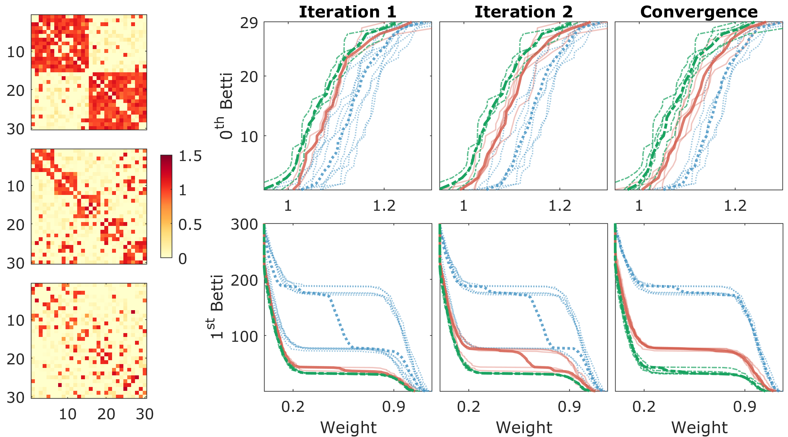

Topological Clustering
======================

<p align="center">
  
</p>

About
-----
A code repository written in Python for topological clustering presented in the ICLR 2022 paper:
- [Fast Topological Clustering with Wasserstein Distance](https://openreview.net/forum?id=0kPL3xO4R5)

This paper proposes a novel and computationally practical topological clustering
method that clusters complex networks with intricate topology using principled
theory from persistent homology and optimal transport.

Quick Start
-----------
1. Prerequisite: install _scikit-learn_
2. Execute `top_clustering.py` script for a demo of the topological clustering method

Citation
--------
Please consider citing our paper if you use this code in your research:
```
@inproceedings{songdechakraiwut2022fast,
    title={Fast topological clustering with {W}asserstein distance},
    author={Tananun Songdechakraiwut and Bryan M Krause and Matthew I Banks and Kirill V Nourski and Barry D Van Veen},
    booktitle={International Conference on Learning Representations},
    year={2022},
    url={https://openreview.net/forum?id=0kPL3xO4R5}
}
```

Contact
-------
If you have any questions, please feel free to contact Tananun Songdechakraiwut (<songdechakra@wisc.edu>).
